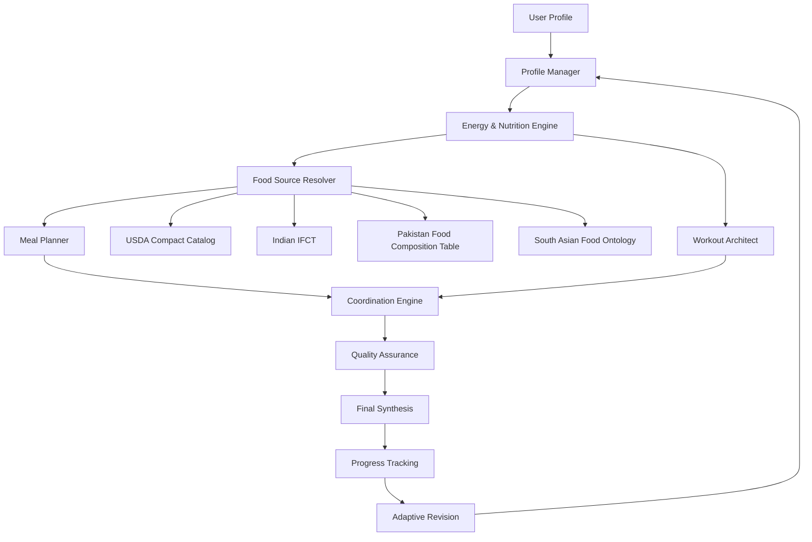

# South Asian AI Fitness Planner 🇵🇰 🇮🇳

[](LICENSE)
[](https://www.python.org/)
[](docs/ARCHITECTURE.md)
[](docs/DATA_SOURCES.md)

A professionally structured South Asian adaptation of the architecture demonstrated by [zen-apps/ai-fitness-planner](https://github.com/zen-apps/ai-fitness-planner).

This project turns the original fitness-planning architecture into a **Pakistan-first, India-aware, South-India-aware nutrition and hypertrophy planning system** designed to work especially well inside Claude Projects.

> **Important:** This repository does not pretend that the original Python/LangGraph/FAISS/MongoDB backend is running inside Claude Projects. Instead, it translates the useful architecture into a rigorous, auditable Claude Project workflow and adds a culturally aware nutrition data layer.

---

## ✨ What this project adds

| Capability | Original reference | This project |
|---|---|---|
| Multi-agent planning | ✅ | ✅ translated + strengthened |
| Profile validation | ✅ | ✅ expanded health/training intake |
| BMR/TDEE | ✅ | ✅ scientific override layer |
| Fixed macro split | Legacy | ❌ replaced with constraint-based macros |
| USDA foods | ✅ | ✅ compact source pipeline |
| Pakistani foods | Limited | ✅ first-class food ontology |
| Indian foods | Limited | ✅ IFCT-aware source strategy |
| South Indian foods | Limited | ✅ dedicated recognition + cuisine layer |
| Recipe decomposition | Limited | ✅ explicit ingredient-composition workflow |
| Food-source attribution | Partial | ✅ required |
| QA pass | Limited | ✅ independent planning audit |
| Adaptive coaching | Not core | ✅ versioned feedback loop |
| Claude Project prompts | ❌ | ✅ included |
| GUI companion | ❌ | ✅ included |

---

## 🧠 Architecture



### Food resolution

```text
user wording
    ↓
alias / transliteration resolution
    ↓
canonical food or dish
    ↓
regional + cuisine classification
    ↓
exact composition source if available
    ↓
recipe decomposition when necessary
    ↓
portion normalization
    ↓
calorie + macro calculation
    ↓
quality audit
```

This is deliberately different from pretending that every dish has one universal calorie value.

---

## 🍛 South Asian coverage

The recognition layer is designed for foods such as:

**Pakistan:** chicken karahi, mutton karahi, nihari, haleem, chicken/mutton/beef biryani, pulao, daal chana, daal mash, rajma, chana, aloo gosht, keema, chapati, roti, naan, paratha, samosa, pakora, dahi bhallay, lassi, kheer and regional vegetables.

**North/West/East India:** rajma, chole, dal makhani, dal tadka, palak paneer, paneer tikka, butter chicken, tandoori chicken, rogan josh, pav bhaji, vada pav, dhokla, thepla, litti chokha and Bengali fish preparations.

**South India:** idli, dosa, masala dosa, rava dosa, uttapam, medu vada, sambar, rasam, curd rice, lemon rice, tamarind rice, pongal, upma, puttu, appam, idiyappam, pathiri, Kerala parotta, chicken Chettinad, chicken 65, Andhra chicken, Hyderabadi biryani and Kerala fish curry.

The ontology is intentionally expandable. **A missing dish does not mean unsupported nutrition**; the system can decompose the recipe into ingredients and use the best available food-composition source.

---

## 📚 Data-source policy

This repository intentionally separates **food recognition** from **food composition**.

- `data/south_asian_food_ontology.csv` is an original recognition/normalization layer. It does not fabricate nutrient values.
- USDA data is handled through a reproducible download/compaction script rather than committed as a giant generated file.
- Indian food composition is sourced from the Indian Food Composition Tables (ICMR–NIN).
- Pakistani food composition is sourced through FAO/INFOODS's Pakistan food-composition resources.
- Official PDFs are **not redistributed by default**; the repository records their authoritative locations and provides a source-download workflow so users can obtain them under the applicable terms.

See [DATA_SOURCES.md](docs/DATA_SOURCES.md) and [THIRD_PARTY_NOTICES.md](third_party_notices/THIRD_PARTY_NOTICES.md).

---

## 🤖 Claude Project integration

The `claude/` directory contains the Project Operating System, architecture bootstrap, intake, full plan-generation, adaptive-coaching and state-snapshot prompts developed from the original repository architecture.

Recommended Claude configuration:

**Model:** Sonnet-class model available on the user's plan  
**Effort:** High for normal planning  
**Thinking:** On  
**Knowledge:** repository architecture + USDA compact dataset + South Asian ontology + Indian/Pakistani food-composition references

Start here:

1. [`claude/project_instructions.md`](claude/project_instructions.md)
2. [`claude/bootstrap_prompt.md`](claude/bootstrap_prompt.md)
3. [`claude/intake_prompt.md`](claude/intake_prompt.md)
4. [`claude/full_plan_prompt.md`](claude/full_plan_prompt.md)
5. [`claude/adaptive_coaching_prompt.md`](claude/adaptive_coaching_prompt.md)
6. [`claude/state_snapshot_prompt.md`](claude/state_snapshot_prompt.md)

---

## 🖥️ GUI companion

A lightweight Streamlit companion is included for presentation and dataset exploration.

```bash
python -m venv .venv
# Windows
.venv\\Scripts\\activate
# macOS/Linux
# source .venv/bin/activate

pip install -r requirements.txt
streamlit run app/streamlit_app.py
```

The GUI provides:

- architecture overview
- food ontology search
- cuisine/region filters
- source-strategy display
- Claude Project workflow navigation
- data-source attribution
- roadmap/status presentation

It is intentionally not marketed as a live medical or clinical system.

---

## 🔧 Rebuild the food knowledge pack

The source pipeline creates the compact USDA catalog locally and maintains the South Asian ontology separately.

```bash
python scripts/build_food_knowledge.py
```

For Windows PowerShell, the equivalent source download helper is:

```powershell
.\\scripts\\download_sources.ps1
```

Large nutrition files are excluded from Git commits by design.

---

## 🔗 Upstream credit

The original architecture and substantial implementation ideas are based on:

**AI Fitness Planner** — `zen-apps/ai-fitness-planner` by **Josh Janzen / zen-apps**  
https://github.com/zen-apps/ai-fitness-planner

The upstream repository is licensed under the **MIT License**. Its original copyright and license notice are preserved in [`third_party_notices/ai-fitness-planner-LICENSE`](third_party_notices/ai-fitness-planner-LICENSE).

This project is an independent adaptation/extension focused on South Asian nutrition workflows, food-source governance, Claude Project orchestration and presentation tooling.

---

## ⚠️ Health and safety

This project is software and planning infrastructure, not a medical diagnosis system. Nutrition estimates can vary with recipe, cooking method, body composition, activity and individual health conditions. Persistent menstrual disruption, unexplained weight changes, severe fatigue, injury, eating-disorder concerns, pregnancy/postpartum complications, or other clinically significant symptoms require appropriate professional assessment.

---

## 🗺️ Roadmap

- [x] Repository-to-Claude architecture translation
- [x] South Asian food ontology
- [x] Pakistan/India/South India food-resolution layer
- [x] Source-attribution rules
- [x] Adaptive coaching workflow
- [x] State snapshot workflow
- [x] GUI companion
- [ ] Fully automated recipe nutrition calculator
- [ ] Structured local-food nutrient cache
- [ ] Exercise library with regional gym-equipment profiles
- [ ] Optional LangGraph runtime restoration
- [ ] Mobile client

---

## License

Project code is released under the MIT License. Third-party material remains subject to its original licenses/terms; see [`NOTICE.md`](NOTICE.md) and [`third_party_notices/`](third_party_notices/).
